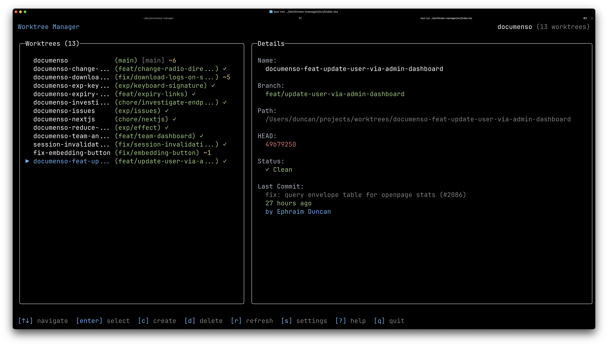

# Git Worktrees Manager

A beautiful TUI (Terminal User Interface) for managing git worktrees - like lazygit, but for worktrees.

Built with [OpenTUI](https://github.com/sst/opentui) and [Bun](https://bun.sh).



## Features

- **Dashboard Layout**: Clean, lazygit-inspired interface with worktree list, details panel, and action bar
- **Worktree Management**: Create, delete, and clean worktrees with interactive wizards
- **Git Status Integration**: Visual indicators for dirty worktrees, staged/modified/untracked files, ahead/behind tracking
- **Branch Information**: See last commit details, author, and timing for each worktree
- **Configuration**: Manage directories and branch prefixes through settings UI
- **Keyboard Navigation**: Vim-style navigation (j/k or arrow keys)

## Installation

### Global Install (npm)

```bash
npm install -g worktrees
```

Then run with:

```bash
worktrees
# or
wt
```

### Using npx/bunx (no install)

```bash
npx worktrees
# or
bunx worktrees
```

### From Source

```bash
git clone https://github.com/ephraimduncan/worktrees.git
cd worktrees
bun install
bun run dev
```

### Compiled Binary

Build a standalone executable:

```bash
bun run build:binary
```

This creates a `worktrees` binary you can move to your PATH.

## Usage

Run the TUI from within any git repository:

```bash
worktrees
```

### Keyboard Shortcuts

**Navigation:**

- `↑/↓` or `j/k` - Move selection up/down
- `Enter` - Print selected worktree path and exit

**Actions:**

- `c` - Create new worktree (interactive wizard)
- `d` - Delete selected worktree
- `D` - Clean all worktrees (except main)
- `r` - Refresh worktree list
- `s` - Open settings

**Other:**

- `?` - Show help
- `q` or `Esc` - Quit application

## Configuration

Configuration is stored in `~/.worktrees`:

```json
{
  "worktreesDir": "/Users/you/.worktrees",
  "defaultBranchPrefix": "",
  "autoRefresh": true,
  "refreshInterval": 5000
}
```

You can edit this through the Settings UI (press `s`) or manually edit the file.

## Development

**Run in development mode:**

```bash
bun run dev
```

**Build for distribution:**

```bash
bun run build          # Build to dist/
bun run build:binary   # Compile standalone binary
```

## License

MIT

## Credits

- Built with [OpenTUI](https://github.com/sst/opentui)
- Inspired by [lazygit](https://github.com/jesseduffield/lazygit)
- Powered by [Bun](https://bun.sh)
